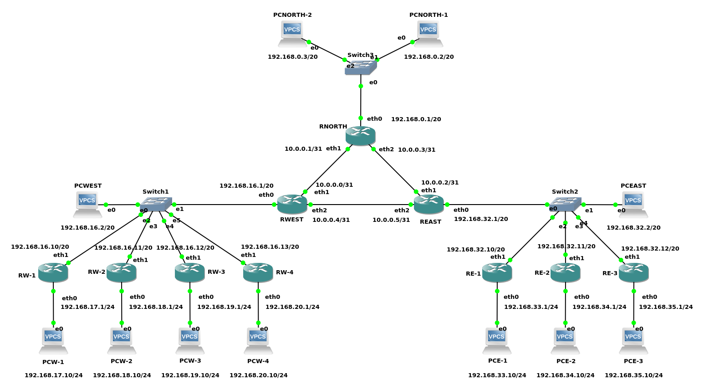

The routers are VyOS (https://vyos.io/) images running with Qemu in
the GNS3 simulator.

By default, the appliance is configured to run in Qemu with KVM
acceleration and the -cpu flag set to host. GNS3 must be configured to
enable KVM appending the following lines into the 'gns3_server.conf'
configuration file (in ~/.config/GNS3/2.2/gns3_server.conf).

```
[Qemu]
enable_kvm = true
```

Also if GNS3 is running inside a VM, enable nested virtualization in
the VM.

The appliance is also configured to use the "virtio-net-pci" network
adapter type instead of the default "e1000" for better network performance.

# Import the appliance

To import the iotsim-vyos.gns3a appliance into GNS3 follow this guide
[https://docs.gns3.com/docs/using-gns3/beginners/import-gns3-appliance/](https://docs.gns3.com/docs/using-gns3/beginners/import-gns3-appliance/).

# Install the routers

After importing the appliance, include the routers in the GNS3 topology. 

Login with vyos/vyos and type `install image`. Accept all the default settings and reboot. Details in [https://docs.vyos.io/en/equuleus/installation/install.html#permanent-installation](https://docs.vyos.io/en/equuleus/installation/install.html#permanent-installation)

# Configure the routers

The configuration for each router are located in the scripts inside the `backbone` and `locations` directories.

For each router, copy the appropriate configuration script into the router: run `nano config.sh` in the router and paste the contents of the configuration file, then:

```
chmod +x config.sh
./config.sh
```

--------------------------------------------------------------------------------



--------------------------------------------------------------------------------

# VyOS manual download and installation:

Download:

https://vyos.net/get/snapshots/

https://s3.amazonaws.com/s3-us.vyos.io/snapshot/vyos-1.3.0-rc6/vyos-1.3.0-rc6-amd64.iso

Read:

https://docs.vyos.io/en/equuleus/installation/virtual/gns3.html
